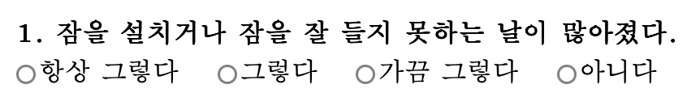
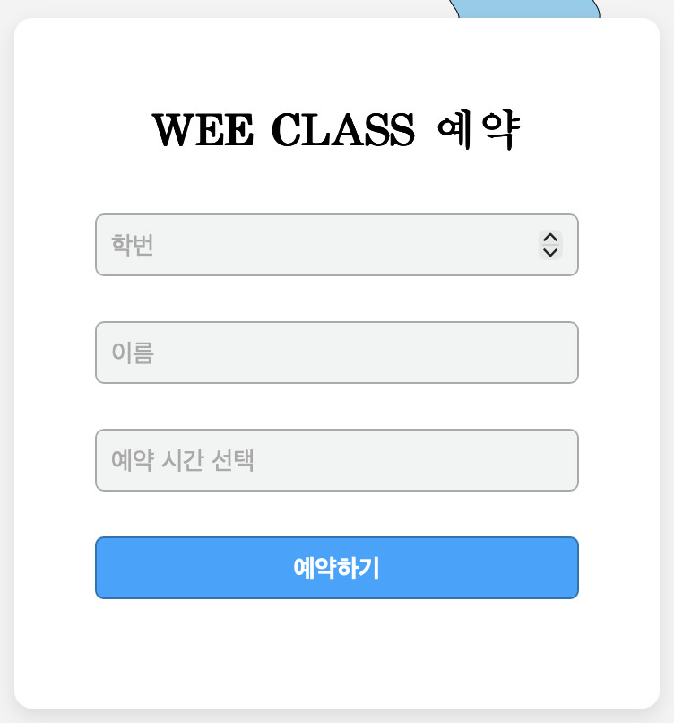

<h2><a href="https://sites.google.com/saerom.hs.kr/depression-test/마음-진단">SAEROM-maeumjindan</a></h2>

<h2>Purpose</h2>

이 프로젝트는 WEE 클래스 선생님과 보건 동아리의 요청으로 WEE 클래스의 불편함을 해결하기 위해 WEE 클래스 선생님의 편의를 중심으로 개발되었습니다

<h2>Element</h2>
<h3>질문지</h3>

이 요소는 학생들이 질문지를 통해 자신의 현재 상태를 알 수 있게 제공합니다.

    
     
    

<h3>예약 폼</h3>

이 요소는 학생들이 WEE 클래스의 예약 상태를 확인하고 예약할 수 있는 기능을 제공합니다.

    
     
    

